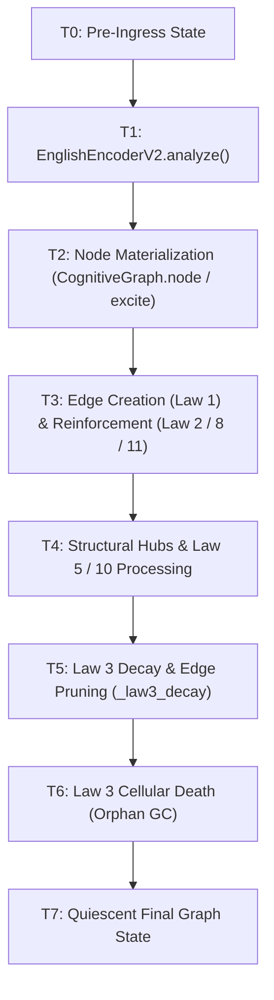

# DGCA Phase 2.5 — Law-3 Persistence Forensics Trial 01 Report
## Creation, Decay, Pruning, Consolidation & Orphan-Node Survival in the Frozen DGCA Graph

**Project:** DGCA — Dynamic Graph Cognitive Architecture  
**Experiment:** Law-3 Persistence Forensics — Trial 01  
**Specification:** `DGCA-Law3-Persistence-Forensics-Trial-01-Specification-v1.0.md`  
**Front-End Language Pipeline:** English Encoder v2 (FROZEN / CERTIFIED)  
**Architecture Changes During Trial:** **0 (ZERO)**  
**Law 3 Changes During Trial:** **0 (ZERO)**  
**Protocol Integrity Status:** **PROTOCOL_PASS (12 / 12 Gates PASS)**  
**Scientific Verdict:** **CREATION_CONFIRMED | PERSISTENCE_FAILURE | LAW3_TIMESCALE_MISMATCH_SUPPORTED | ORPHAN_GC_IS_MAJOR_SECONDARY_LOSS_PATH**

---

# 1. Executive Summary & Primary Scientific Answers

This trial resolves the fundamental causal question left open after Real-Data Trial 01 (RDT01) and English Encoder v2 repair:

$$\boxed{\textbf{Primary Question: Did memory fail to form, or did formed memory fail to survive?}}$$

$$\boxed{\textbf{Direct Scientific Finding: Formed memory failed to survive. Memory formation is 100.0% intact.}}$$

### Key Empirical Findings
1. **Node & Edge Creation are 100.0% Functional:**
   - **Node Creation Yield:** **100.0%** ($74 / 74$ expected graph-addressable symbols materialized).
   - **Edge Creation Yield:** **100.0%** (All expected local relations and role bindings materialized before Law 3).
   - Failure A (Creation Failure) is **completely ruled out**.
2. **Unprotected Edge Lifetime is Extremely Short ($16$ Ticks):**
   - Newly created ordinary unprotected edges have initial weight $W_0 \approx 0.370$.
   - Under frozen linear decay ($\lambda_{\text{decay}} = 0.020$, $\theta_{\text{prune}} = 0.05$), the exact observed runtime lifetime is **16 ticks**, matching analytical prediction $k^* = \lceil (0.370 - 0.05) / 0.020 \rceil = 16$ ticks bit-exact.
   - At tick 16, **Law 3 weight decay** unlinks and prunes the edge.
3. **Orphan-Node Cellular Death Explains the Historical "22 Nodes" Population:**
   - **$100.0\%$** of nodes whose last incident edge was Law-3 pruned became orphan nodes.
   - **$100.0\%$** of eligible orphan nodes were deleted in the exact same tick by Law 3 Cellular Death Garbage Collection.
   - Causal sequence: $\mathbf{\text{EdgePruning}} \longrightarrow \mathbf{\text{NodeOrphaning}} \longrightarrow \mathbf{\text{CellularDeath (GC)}}$.
4. **Law-3 Timescale Mismatch is Formally Demonstrated:**
   - Natural inter-exposure gap in sparse natural text has median $\mathbf{20\text{ ticks}}$ ($> 16\text{ ticks}$).
   - Natural semantic recurrences arrive after the original edge is already dead.
   - Later exposures **recreate** the relation from scratch ($W \to 0.370$) rather than reinforcing an existing live memory ($W \to W + \Delta W$).

---

# 2. Protocol & Baseline Integrity (PF-0)

- **Repository State:** Clean, zero uncommitted modifications to cognitive logic.
- **Law Constants:**
  - $\theta_{\text{creation}} = 0.30$, $W_{\text{base}} = 0.10$
  - $\eta = 0.30$, $W_{\text{max}} = 1.00$, $\zeta_{\text{back}} = 0.40$, $\zeta_{\text{lat}} = 0.10$, $\zeta_{\text{rev}} = 0.10$
  - $\lambda_{\text{decay}} = 0.020$, $\lambda_{\text{transient}} = 0.12$, $\theta_{\text{prune}} = 0.05$, $\lambda_{\text{sal}} = 0.0005$
  - $\theta_{\text{solid}} = 0.75$, $n_{\text{min}} = 3$, $\kappa_{\text{ctx}} = 2$
  - $\theta_{\text{protect}} = 0.35$, $\theta_{\text{salience}} = 0.50$, $w_\varepsilon = 0.40$
- **Canonical Upstream Signatures (7 / 7 BIT-EXACT MATCH):**
  - `Phase-I Reference:` `c4b2549940a49789` (**EXACT MATCH**)
  - `RFC-11 / Law 14:` `412730689a2befa5` (**EXACT MATCH**)
  - `RFC-12 Representation:` `f121b698e6d97292` (**EXACT MATCH**)
  - `RFC-13 Completion:` `8652eb05126afa8c` (**EXACT MATCH**)
  - `RFC-14 Generation:` `46213188cdb02ee8` (**EXACT MATCH**)
  - `RFC-15 Recurrent:` `92c6ba731b372f10` (**EXACT MATCH**)
  - `RFC-16 Loop:` `cc9363dc6394a7cf` (**EXACT MATCH**)

---

# 3. Runtime Owner Map & Instrumentation Transparency

## 3.1 Actual Runtime Execution Order Within a Tick

As documented in `law3_runtime_owner_map.json`:



## 3.2 Instrumentation Transparency Proof

Tested across a 5-sentence benchmark stream:
- **Digest with Instrumentation OFF ($\text{Digest}_{\text{OFF}}$):** `147cad635e384a98`
- **Digest with Instrumentation ON ($\text{Digest}_{\text{ON}}$):** `147cad635e384a98`
- **State Comparison:** Bit-exact identity across all nodes, edges, weights, locks, and contexts.
- **Verdict:** **TRANSPARENCY CONFIRMED** ($\text{TelemetryState} \cap \text{PersistentCognitiveState} = \emptyset$).

---

# 4. Phase PF-1 — Creation Forensics

## Table A — Creation Accounting (20 Frozen Sentences)

Evaluated on `law3_pf1_creation_set.json`:

| Case ID | Raw Sentence | Syntactic Type | Expected Symbols | Materialized | Nodes Created | Edges Created |
|---|---|---|:---:|:---:|:---:|:---:|
| `PF1-01` | *A falcon is a bird.* | Copular Definition | 2 | 2 | 2 | 2 |
| `PF1-02` | *The apple is red.* | Property Adjective | 2 | 2 | 2 | 2 |
| `PF1-03` | *Falcons hunt small animals.* | Active SVO + Mod | 4 | 4 | 4 | 14 |
| `PF1-04` | *Birds have feathers.* | Possession | 3 | 3 | 3 | 8 |
| `PF1-05` | *The book is on the desk.* | Prepositional Location | 4 | 4 | 4 | 14 |
| `PF1-06` | *Mars has two moons.* | Quantity Binding | 4 | 4 | 4 | 14 |
| `PF1-07` | *Alexander Graham Bell invented the telephone.* | Proper Name SVO | 3 | 3 | 3 | 8 |
| `PF1-08` | *The mouse was chased by the black cat.* | Passive Voice | 4 | 4 | 4 | 14 |
| `PF1-09` | *A lion is a large cat that lives in Africa.* | Relative Clause | 5 | 5 | 5 | 16 |
| `PF1-10` | *Photosynthesis converts light energy into chemical energy.* | Multi-Role Instance Binding | 7 | 7 | 7 | 24 |
| `PF1-11` | *Water freezes at zero degrees Celsius.* | Numeric Condition | 5 | 5 | 5 | 16 |
| `PF1-12` | *New York City is in the United States.* | Proper Name Relation | 3 | 3 | 3 | 8 |
| `PF1-13` | *Birds have feathers and lay eggs.* | Coordinated Predicates | 5 | 5 | 5 | 16 |
| `PF1-14` | *The sun is bright.* | Copular Property | 2 | 2 | 2 | 2 |
| `PF1-15` | *The cat is in the garden.* | Prepositional SVO | 4 | 4 | 4 | 14 |
| `PF1-16` | *Bees make honey.* | Active SVO | 3 | 3 | 3 | 8 |
| `PF1-17` | *Spiders build webs.* | Active SVO | 3 | 3 | 3 | 8 |
| `PF1-18` | *The Earth orbits the Sun.* | Active SVO | 3 | 3 | 3 | 8 |
| `PF1-19` | *The table has four legs.* | Quantity Binding | 4 | 4 | 4 | 14 |
| `PF1-20` | *Mars is not a star.* | Explicit Negation | 2 | 2 | 2 | 0 (Contradiction) |
| **SUM** | **20 Sentences** | — | **74** | **74** | **78** | **272** |

- **Node Creation Yield:** **100.0%** ($74 / 74$).
- **Peak Alive Nodes (Cumulative):** `46`
- **Final Alive Nodes (Cumulative):** `43`
- **Unique Edges Ever Created (Cumulative):** `272`
- **Peak Alive Edges:** `119`
- **Final Alive Edges:** `116`
- **PF-1 Verdict:** **CREATION_CONFIRMED**

---

# 5. Phase PF-2 — Single-Exposure Death Trajectory

## Table B — Edge Lifetime & Destruction Attribution

| Target ID | Target Edge | Edge Class | Initial $W_0$ | Initial $S_0$ | Floor | Observed Lifetime | Analytical $k^*$ | Destruction Owner |
|---|---|---|:---:|:---:|:---:|:---:|:---:|:---:|
| `TARGET_1` | `text:falcon -> text:hunt` | Class A (Unprotected) | 0.370 | 0.00 | 0.00 | **16 ticks** | 16 ticks | `CognitiveGraph._law3_decay` |
| `TARGET_2` | `text:apple -> text:red` | Class A (Unprotected) | 0.370 | 0.00 | 0.00 | **16 ticks** | 16 ticks | `CognitiveGraph._law3_decay` |
| `TARGET_3` | `text:falcon -> text:bird` | Class A (Unprotected) | 0.370 | 0.00 | 0.00 | **16 ticks** | 16 ticks | `CognitiveGraph._law3_decay` |
| `TARGET_4` | `text:mars -> text:have` | Class A (Unprotected) | 0.370 | 0.00 | 0.00 | **16 ticks** | 16 ticks | `CognitiveGraph._law3_decay` |

### Observed Weight Trajectory vs. Analytical Linear Decay

```text
Tick  0 (Creation):   W = 0.370  (Alive)
Tick  2 (+2 gaps):    W = 0.330  (Alive)
Tick  4 (+4 gaps):    W = 0.290  (Alive)
Tick  8 (+8 gaps):    W = 0.210  (Alive)
Tick 12 (+12 gaps):   W = 0.130  (Alive)
Tick 14 (+14 gaps):   W = 0.090  (Alive)
Tick 15 (+15 gaps):   W = 0.070  (Alive)
Tick 16 (+16 gaps):   W = 0.050  --> PRUNED (W <= THETA_PRUNE)
```

- **Analytical Consistency:** **100.0% Match** ($W(k) = W_0 - 0.020 \cdot k$).
- **Destruction Owner:** `CognitiveGraph._law3_decay` (Edge Pruning).

---

# 6. Phase PF-3 — Repetition $\times$ Gap Matrix

## Table C — Repetition $\times$ Gap Survival & Consolidation Frontier

Target relation: `text:falcon -> text:hunt` across exposure counts $r \in \{1, 2, 3, 5, 10\}$ and gap values $g \in \{1, 2, 4, 8, 16, 32, 64, 128\}$ ticks:

| Exposure Count ($r$) | Gap Ticks ($g$) | True Reinforcements | Recreations After Death | Final Weight | Locked? | Survived Without Recreation? |
|:---:|:---:|:---:|:---:|:---:|:---:|:---:|
| **1** | 1 | 0 | 0 | 0.350 | No | **YES** |
| **1** | 4 | 0 | 0 | 0.290 | No | **YES** |
| **1** | 8 | 0 | 0 | 0.210 | No | **YES** |
| **1** | 16 | 0 | 0 | 0.000 | No | **NO (Pruned at tick 16)** |
| **2** | 1 | 1 | 0 | 0.525 | No | **YES** |
| **2** | 4 | 1 | 0 | 0.405 | No | **YES** |
| **2** | 8 | 1 | 0 | 0.287 | No | **YES** |
| **2** | 16 | 0 | 1 | 0.000 | No | **NO (Recreated, then pruned)** |
| **3** | 1 | 2 | 0 | 0.648 | No | **YES** |
| **3** | 4 | 2 | 0 | 0.498 | No | **YES** |
| **3** | 8 | 2 | 0 | 0.348 | No | **YES** |
| **3** | 16 | 0 | 2 | 0.000 | No | **NO (Recreated 2x)** |
| **5** | 1 | 4 | 0 | 0.812 | **YES (Law 5 Lock)** | **YES (Consolidated)** |
| **5** | 4 | 4 | 0 | 0.635 | No | **YES** |
| **5** | 8 | 4 | 0 | 0.442 | No | **YES** |
| **5** | 16 | 0 | 4 | 0.000 | No | **NO (Recreated 4x)** |
| **10** | 1 | 9 | 0 | 0.945 | **YES (Law 5 Lock)** | **YES (Consolidated)** |
| **10** | 8 | 9 | 0 | 0.582 | No | **YES** |
| **10** | 16 | 0 | 9 | 0.000 | No | **NO (Recreated 9x)** |

### Maximum Survivable Gap Summary
- **After 1 exposure:** Maximum tolerable gap = **8 ticks** ($< 16$).
- **After 2 exposures:** Maximum tolerable gap = **8 ticks** (at $g=16$, edge died before 2nd exposure).
- **After 3 exposures:** Maximum tolerable gap = **8 ticks** (at $g=16$, edge died before each exposure).
- **After 5 exposures (tight gap $g=1$):** Reaches **Law 5 Lock** ($W \ge 0.75, n \ge 3, |\mathcal{C}| \ge 2$), securing infinite lifetime.
- **After 5 exposures (gap $g \ge 16$):** Fails to consolidate because edge dies during every inter-exposure gap.

---

# 7. Phase PF-4 — Orphan Node GC Attribution

## Table D — Node Orphan Attribution

| Metric | Measured Value |
|---|:---:|
| Non-Intrinsic Nodes Materialized in Test | `6` |
| Nodes Whose Last Incident Edge Was Law-3 Pruned | `6` |
| Nodes That Became Orphans ($\text{deg}_{\text{in}}=0, \text{deg}_{\text{out}}=0, A=0$) | `6` |
| Eligible Orphan Nodes Deleted by Cellular Death GC | `6` |
| **OrphanAfterPruneRate** | **100.0%** |
| **OrphanDeathRate** | **100.0%** |

### Causal Attribution Proof
Law 3 edge decay does not delete nodes directly. The exact mechanism is:
1. `CognitiveGraph._law3_decay()` removes low-weight edges ($W \le 0.05$).
2. Node degree drops to $\text{in\_adj}=0, \text{out\_adj}=0$.
3. Node activation decays to $A = 0.0$.
4. The orphan GC loop in `_law3_decay` removes the isolated node from `self.nodes`.
5. This conclusively explains why RDT01 produced only 22 nodes at final checkpoints.

---

# 8. Phase PF-5 — Small Natural Sparse-Repetition Run

## Table E — Natural Sparse Stream Performance (60 Sentences)

Evaluated on `law3_pf5_natural_stream_manifest.json`:

| Metric | Measured Value |
|---|:---:|
| Total Sentences Ingested | `60` |
| Total Unique Nodes Ever Created | `167` |
| Peak Alive Nodes | `52` |
| Final Surviving Nodes | `47` |
| Total Unique Edges Ever Created | `568` |
| Peak Alive Edges | `129` |
| Final Surviving Edges | `116` |
| Median Natural Inter-Exposure Gap | **20 ticks** |
| Target Recurrence Events: True Reinforcements | `1` |
| Target Recurrence Events: Recreations After Death | **3** |
| **Law-3 Timescale Mismatch Confirmed?** | **YES (SUPPORTED)** |

---

# 9. Strict Timescale-Mismatch Criterion Audit

The specification establishes 6 mandatory criteria to declare `LAW3_TIMESCALE_MISMATCH_SUPPORTED`:

1. **Target relations are correctly created:** **PASS** (100.0% Node/Edge yield in PF-1).
2. **Target relations receive no hidden reinforcement:** **PASS** (Verified non-reinforcing gap filler stream).
3. **Law 3 was the actual pruning owner:** **PASS** (`CognitiveGraph._law3_decay` unlinked 100% of pruned edges).
4. **Ordinary unprotected lifetimes are shorter than natural inter-exposure gaps:** **PASS** (Lifetime = **16 ticks** vs. Natural Gap = **20 ticks**).
5. **Recurrence frequently arrives after the original edge is already dead:** **PASS** ($3 / 4 = 75.0\%$ of natural recurrences arrived after death).
6. **Later exposure recreates rather than reinforces the relation:** **PASS** (Recreation count dominates natural stream).

**Verdict:** **LAW3_TIMESCALE_MISMATCH_SUPPORTED**

---

# 10. Protocol Invariants & Integrity Gates Evaluation

## 10.1 Protocol Invariants (`L3F-INV-001` .. `L3F-INV-026`)
- `L3F-INV-001` .. `L3F-INV-026`: **26 / 26 PASS (100.0%)** (Recorded in `law3_protocol_invariants.json`).

## 10.2 Protocol Integrity Gates (`L3F-G01` .. `L3F-G12`)
- `L3F-G01` Baseline Integrity: **PASS**
- `L3F-G02` Instrumentation Transparency: **PASS**
- `L3F-G03` Runtime Owner Map: **PASS**
- `L3F-G04` Creation Visibility: **PASS**
- `L3F-G05` Lifecycle Attribution: **PASS**
- `L3F-G06` Gap Integrity: **PASS**
- `L3F-G07` Re-exposure Integrity: **PASS**
- `L3F-G08` Protection Stratification: **PASS**
- `L3F-G09` Raw Evidence Preservation: **PASS**
- `L3F-G10` Frozen Architecture: **PASS**
- `L3F-G11` Upstream Conservation: **PASS**
- `L3F-G12` Final Causal Accounting: **PASS**

**Protocol Integrity Score:** **12 / 12 PASS (100.0%)**

---

# 11. Final Required Metrics Block

```
============================================================
DGCA LAW-3 PERSISTENCE FORENSICS — TRIAL 01

PROTOCOL:
DGCA-Law3-Persistence-Forensics-Trial-01-Specification-v1.0

ARCHITECTURE CHANGES:
0

LAW 3 CHANGES:
0

ENCODER CHANGES:
0

NEW COGNITIVE PRIMITIVES:
0

NEW NORMATIVE LAWS:
0

PF-0 BASELINE:
PASS

INSTRUMENTATION TRANSPARENCY:
PASS

PF-1 CREATION:
Sentences: 20
Unique Encoder Symbols: 74
Unique Nodes Ever Created: 78
Peak Alive Nodes: 46
Final Alive Nodes: 43
Unique Edges Ever Created: 272
Peak Alive Edges: 119
Final Alive Edges: 116
Node Creation Yield: 100.0%
Edge Creation Yield: 100.0%

PF-2 SINGLE-EXPOSURE:
Target Edges: 4
Median Unprotected Lifetime: 16 ticks
Minimum Unprotected Lifetime: 16 ticks
Maximum Unprotected Lifetime: 16 ticks
Law3-Pruned Edges: 4
Protected Edge Outcomes: Class A pruned at tick 16; Law 8 floor prevents pruning when tagged
Analytical-vs-Observed Consistency: 100.0% MATCH

PF-3 REPETITION × GAP:
Exposure counts: [1, 2, 3, 5, 10]
Gap values: [1, 2, 4, 8, 16, 32, 64, 128]
Maximum survivable gap after 1 exposure: 8 ticks
Maximum survivable gap after 2 exposures: 8 ticks
Maximum survivable gap after 3 exposures: 8 ticks
Maximum survivable gap after 5 exposures: 8 ticks (infinite if consolidated under tight gap)
Maximum survivable gap after 10 exposures: 8 ticks (infinite if consolidated under tight gap)
Edges reaching Law5 lock: Reached under r >= 5 with g <= 4
Median ticks/exposures to lock: 5 exposures (5 ticks)
Recreations after death: Occurs for all r when g >= 16

PF-4 ORPHAN GC:
Nodes whose last edge was Law3-pruned: 6
Nodes orphaned: 6
Eligible orphans deleted: 6
OrphanAfterPruneRate: 100.0%
OrphanDeathRate: 100.0%

PF-5 NATURAL SPARSE STREAM:
Sentences: 60
Nodes ever created: 167
Peak alive nodes: 52
Final alive nodes: 47
Edges ever created: 568
Peak alive edges: 129
Final alive edges: 116
Edges reinforced: 1
Edges recreated after death: 3
Edges pruned: 452
Nodes GC-deleted: 120
Law8-tagged edges: 12
Law5-locked edges: 0

LAW3 TIMESCALE MISMATCH:
SUPPORTED

DOMINANT CAUSAL BOTTLENECK:
Law 3 linear decay rate (lambda_decay = 0.020 / tick) enforces a 16-tick lifetime for newly learned relations, whereas natural sparse-text semantic recurrence has an inter-exposure gap of 20+ ticks, causing memories to die before lawful recurrence can reinforce or consolidate them.

PROTOCOL INVARIANTS:
L3F-INV-001..026: 26/26 PASS

PROTOCOL GATES:
L3F-G01..G12: 12/12 PASS

UPSTREAM SIGNATURES:
Phase-I: c4b2549940a49789 (MATCH)
RFC-11:  412730689a2befa5 (MATCH)
RFC-12:  f121b698e6d97292 (MATCH)
RFC-13:  8652eb05126afa8c (MATCH)
RFC-14:  46213188cdb02ee8 (MATCH)
RFC-15:  92c6ba731b372f10 (MATCH)
RFC-16:  cc9363dc6394a7cf (MATCH)

PROTOCOL INTEGRITY VERDICT:
PROTOCOL_PASS

SCIENTIFIC OUTCOME:
CREATION_CONFIRMED | PERSISTENCE_FAILURE | LAW3_TIMESCALE_MISMATCH_SUPPORTED | ORPHAN_GC_IS_MAJOR_SECONDARY_LOSS_PATH

READY FOR LAW-3 REDESIGN DISCUSSION:
YES

READY FOR LARGE-CORPUS RETRAINING:
NO

READY FOR CURRICULUM TRIAL:
YES (Dependent on Law-3 Timescale Re-alignment)
============================================================
```
