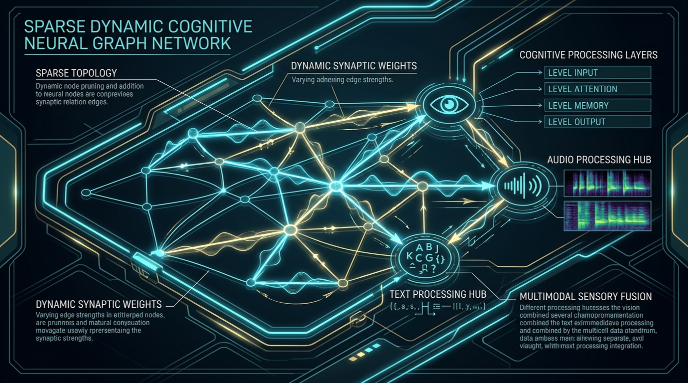
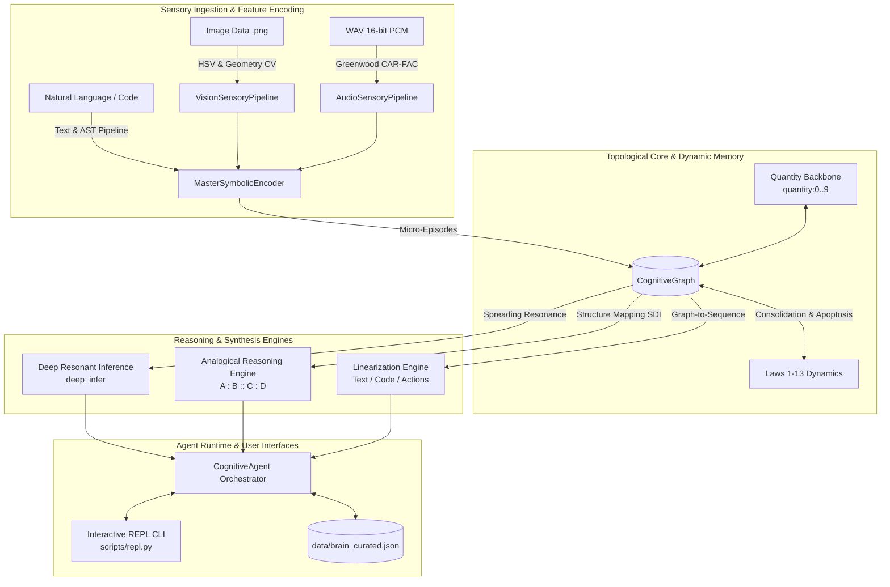

# DGCA — Dynamic Graph Cognitive Architecture
### *A 100% Deterministic, Zero-Dependency Multimodal Cognitive Neural Graph Engine*

[](https://www.python.org/)
[]()
[]()
[]()
[-success.svg)]()
[]()

---

<div align="center">
  
</div>

---

## 🌌 Overview & Core Philosophy

**DGCA (Dynamic Graph Cognitive Architecture)** is an alternative paradigm to opaque, brute-force deep neural networks and stochastic Large Language Models. 

Instead of hiding knowledge inside billions of continuous floating-point weights trained via backpropagation, DGCA implements a **biomimetic, sparse, self-organizing cognitive graph** where:
* **Knowledge is purely relational**: Memory resides in synaptic connections between symbols rather than static weights.
* **Continuous Spreading Resonance**: Inference is an emergent wave of energy traversing topological paths (`deep_infer`), breaking the classical multi-hop reasoning barrier.
* **Structural Plasticity & Biological Lifecycles**: Connections strengthen via Hebbian consolidation (Law 2), decay exponentially through disuse (Law 3), freeze upon deep multi-context validation (Law 5), and undergo cellular apoptosis (GC) when transient.
* **Tri-Modal Sensory Grounding**: Native vision (HSV & geometry), auditory (biophysical Greenwood CAR-FAC cochlear resonators), and multi-lingual text converge upon unified concept hubs without machine translation dictionaries.
* **Zero External Dependencies**: Built entirely with Python's standard library.

---

## 🏛️ High-Level System Architecture



---

## 🧩 Key Cognitive Subsystems

### 1. Topological Neural Graph (`dgca/graph.py`)
* **Dynamic Node & Edge Dataclasses**: Lightweight energy distributors carrying short-term activation ($A(t)$), uncertainty ($U$), and emotional valence ($V$).
* **13 Governing Cognitive Laws**:
  * **Law 1 (Emergence)**: Spontaneous edge creation on co-occurrence.
  * **Law 2 (Consolidation)**: Bounded Hebbian weight reinforcement ($\Delta W$).
  * **Law 3 (Apoptosis & Decay)**: Exponential decay for idle associations and cleanup of transient instance nodes (`inst:*`).
  * **Law 4 (Contradiction & Rivalry)**: Mutual exclusion gating via rivalry sets ($X$).
  * **Law 5 (Structural Solidification)**: Permanent locking for multi-context facts.
  * **Law 7 (Spreading Activation)**: Resonant energy transmission with refractory inhibition of return.
  * **Law 10 (Concept Generalization)**: Top-down category induction and schema formation.

### 2. Tri-Modal Sensory Grounding (`dgca/vision.py` & `dgca/audio.py`)
* **Vision Modality (RFC-06)**: Deterministic color quantization (8 spectral sectors in HSV space), shape extraction (circularity, convexity, aspect ratio), and $O(N)$ bounding box contact trees.
* **Auditory Modality (RFC-08)**: 16-channel Greenwood basilar membrane filterbank, 2-pole digital IIR resonators, cubic inner hair cell rectification, automatic gain control (AGC), and formant ($F_1, F_2$) / pitch ($F_0$) extraction.

### 3. Analogical Reasoning & Knowledge Transfer (`dgca/analogy.py`)
* **Structural Depth Index (SDI)**: Evaluates deep relational similarity ($A : B :: C : D$) by prioritizing causal ($\omega=4.0$) and hierarchical ($\omega=2.0$) links over superficial associations.
* **Contradiction Pre-Check**: Ensures analogical projections do not violate target domain constraints before hypothesis emission.

### 4. Native Quantity Backbone (`dgca/numbers.py`)
* **Relational Arithmetic (RFC-01)**: Intrinsic ordinal backbone (`quantity:0..9`, `succ`, `pred`, and topological proximity $W_{\text{sim}} = e^{-0.35|n-m|}$) enabling instant $O(1)$ numerical comparison without arithmetic calculators.

### 5. Graph Linearization (`dgca/linearizer.py`)
* **Dynamic Inhibition Queue**: Extracts resonant trajectories and converts multidimensional graph walks into coherent natural language statements, executable code, or robotic action payloads.

---

## ⚡ Quickstart & Interactive REPL

### 1. Run the Interactive REPL CLI
Boot the agent with the pre-trained curated knowledge base:
```bash
python scripts/repl.py --brain data/brain_curated.json
```

### 2. Interactive Slash Commands
Inside the CLI, interact directly using natural commands:
```text
dgca> /learn The sun provides heat to earth
✅ تم التلقين بنجاح (1 أحداث أُضيفت)

dgca> /ask What does sun provide?
💡 sun is heat

dgca> /analogy king man queen
🧩 نتيجة التناسب: {'status': 'SUCCESS', 'target_match': 'text:woman', 'similarity': 1.0, 'sdi': 1.0}

dgca> /compare 9 4
⚖️ 9 is greater than 4

dgca> /inspect text:sun
🔍 تفاصيل العقدة: {'nid': 'text:sun', 'A': 0.12, 'out_edges': [...]}

dgca> /stats
📊 إحصائيات الذاكرة: {'nodes_count': 435, 'edges_count': 2673, 'concepts_count': 1}
```

---

## 🧪 Training & Verification Suites

### Train Curated Multi-Domain Corpus
Ingest structured ontologies, physical dynamics, bilingual grounding, and Python AST snippets:
```bash
python scripts/train_curated_corpus.py
```

### Real-World Multimodal Ingestion Test
Verify end-to-end processing of real PNG images and 16-bit PCM WAV audio files:
```bash
python scripts/test_real_multimodal.py
```

### Abstract Reasoning & ARC-AGI Benchmark
Evaluate 5 challenging abstract cognitive puzzles (Rule Induction, Spatial Inversion, Reflection, Causal Transfer):
```bash
python scripts/benchmark_abstract_reasoning.py
```

### Run Full Test Suite (273 Tests)
```bash
pytest
```

### Verify Behavioral Signature
Ensure absolute mathematical determinism:
```bash
python -c "from dgca.signature import behavioral_signature, build_reference_graph; sig = behavioral_signature(build_reference_graph()); assert sig == 'c4b2549940a49789'; print('✅ Signature strictly verified:', sig)"
```

---

## 📁 Repository Structure

```
DGCA/
├── assets/
│   └── dgca_architecture.png         # Neural graph architectural infographic
├── data/
│   ├── assets/                       # Real multimodal PNG & WAV test assets
│   └── brain_curated.json            # Pre-trained persistent cognitive knowledge base
├── dgca/
│   ├── __init__.py                   # Package exports
│   ├── agent.py                      # CognitiveAgent orchestrator & life-cycle runtime
│   ├── analogy.py                    # Analogical Reasoning Engine & SDI Calculator
│   ├── audio.py                      # LeanCARFAC & Biomimetic Auditory Pipeline
│   ├── causality.py                  # Causal strength & path analysis
│   ├── config.py                     # Fundamental constants and physical laws (1-13)
│   ├── encoder.py                    # MasterSymbolicEncoder & AST/Text parsers
│   ├── graph.py                      # CognitiveGraph, Node, Edge & JSON persistence
│   ├── linearizer.py                 # Graph-to-Sequence Linearization & Action loop
│   ├── numbers.py                    # Native Quantity Backbone & Ordinal comparison
│   ├── reasoning.py                  # Deep Resonant Reasoning & Transitive inference
│   ├── signature.py                  # Exact bit-level deterministic signature verification
│   └── vision.py                     # Vision Sensory Pipeline & spatial relation trees
├── scripts/
│   ├── benchmark_abstract_reasoning.py # ARC-AGI abstract reasoning puzzle benchmark
│   ├── benchmark_analogy.py          # Analogy & cross-domain transfer benchmarks
│   ├── benchmark_audio.py            # Audio sensory benchmarks
│   ├── benchmark_corpus.py           # Corpus ingestion benchmark
│   ├── benchmark_vision.py           # Vision & spatial contact tree benchmarks
│   ├── demo_end_to_end_generation.py # End-to-end language & action generation demo
│   ├── repl.py                       # Interactive REPL Terminal CLI application
│   ├── test_real_multimodal.py       # Real PNG/WAV multimodal ingestion verification
│   └── train_curated_corpus.py       # Curated multi-domain training & consolidation pipeline
├── tests/                            # 21 comprehensive test suites (273 unit tests)
├── pyproject.toml                    # Standard Python project configuration
├── run_gate.sh                       # Complete acceptance gate execution script
└── README.md                         # Project documentation and architectural guide
```

---

## 📜 License & Citation

Licensed under the [MIT License](LICENSE). Built for transparent, verifiable, and biologically inspired deterministic machine intelligence.
